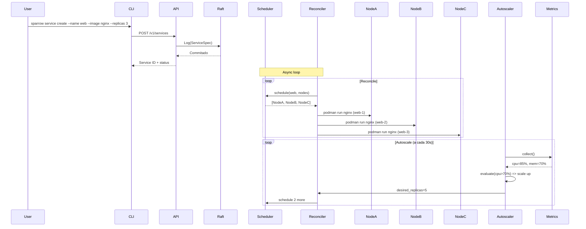

# Arquitetura do Sparrow

## Visão Geral

```
┌──────────────────────────────────────────────────────────────────────────┐
│                        CONTROL PLANE                                     │
│                                                                          │
│  ┌─────────┐   ┌──────────┐   ┌──────────┐   ┌───────────────┐         │
│  │ CLI     │   │ API      │   │ Scheduler │   │ State Machine │         │
│  │ (clap)  │──▶│ (axum)   │──▶│ (tokio)  │──▶│ (raft-rs)     │         │
│  └─────────┘   └──────────┘   └──────────┘   └───────┬───────┘         │
│                           │                           │                  │
│                    ┌──────┴──────┐           ┌────────┴────────┐       │
│                    │ Reconciler  │           │   Cluster       │       │
│                    │ (loop 10s)  │           │   Membership    │       │
│                    └──────┬──────┘           └─────────────────┘       │
│                           │                                             │
│                    ┌──────┴──────┐      ┌──────────────────┐           │
│                    │ Autoscaler  │      │  Reverse Proxy   │           │
│                    │ (metrics →  │      │  (hyper + rustls)│           │
│                    │  decision)  │      │  :80, :443       │           │
│                    └─────────────┘      └──────────────────┘           │
└──────────────────────────┬───────────────────────────────────────────┘
                           │ mTLS / gRPC
                           │
        ┌──────────────────┼──────────────────┐
        │                  │                  │
┌───────┴───────┐  ┌───────┴───────┐  ┌───────┴───────┐
│   Node A      │  │   Node B      │  │   Node C      │
│               │  │               │  │               │
│  ┌─────────┐  │  │  ┌─────────┐  │  │  ┌─────────┐  │
│  │ Podman  │  │  │  │ Podman  │  │  │  │ Podman  │  │
│  │ Quadlet │  │  │  │ Quadlet │  │  │  │ Quadlet │  │
│  └─────────┘  │  │  └─────────┘  │  │  └─────────┘  │
│  ┌─────────┐  │  │  ┌─────────┐  │  │  ┌─────────┐  │
│  │ Wireguard│ │  │  │ Wireguard│ │  │  │ Wireguard│ │
│  └─────────┘  │  │  └─────────┘  │  │  └─────────┘  │
└───────────────┘  └───────────────┘  └───────────────┘
```

## Componentes

### 1. CLI (command-line interface)

Interface primária de interação. Comandos no estilo Swarm:

```bash
sparrow cluster init                    # Inicializa cluster
sparrow cluster join <token>            # Entra no cluster
sparrow service create --name web ...   # Cria serviço
sparrow service scale web --replicas 5  # Escala
sparrow service logs web --follow       # Logs em tempo real
sparrow service ps web                  # Status dos containers
sparrow node ls                         # Lista nós
sparrow autoscale set web --min 2 --max 20  # Configura auto-scaling
```

### 2. API Server (axum + tonic)

Servidor HTTP/gRPC que expõe todas as operações:

```
POST   /v1/services              → criar serviço
GET    /v1/services              → listar serviços
GET    /v1/services/:id          → detalhes do serviço
DELETE /v1/services/:id          → remover serviço
POST   /v1/services/:id/scale    → escalar
POST   /v1/services/:id/update   → rolling update
GET    /v1/services/:id/logs     → stream de logs (SSE)
POST   /v1/services/:id/autoscale → configurar autoscaling

GET    /v1/nodes                 → listar nós
GET    /v1/nodes/:id             → detalhes do nó
DELETE /v1/nodes/:id             → remover nó (drain)

GET    /v1/metrics               → métricas do cluster
GET    /v1/events                → stream de eventos (SSE)
```

### 3. Scheduler

Decide **onde** cada container roda. Estratégias:

- **Spread**: distribui uniformemente entre nós (padrão)
- **Binpack**: concentra nos nós mais cheios (econômico)
- **Least-loaded**: prioriza nós com mais recursos livres
- **Node-pin**: fixa em nó específico (via label)

```rust
// Pseudocódigo do scheduler
fn schedule(service: &ServiceSpec, nodes: &[NodeState]) -> Vec<Assignment> {
    let replicas = service.desired_replicas;
    let candidates = filter_by_constraints(service, nodes);
    
    match service.strategy {
        Strategy::Spread => spread_across(candidates, replicas),
        Strategy::Binpack => binpack_into(candidates, replicas),
        Strategy::LeastLoaded => pick_least_loaded(candidates, replicas),
        Strategy::NodePin(node) => assign_to(node, replicas),
    }
}
```

### 4. Reconciler

Loop contínuo que garante que o estado real corresponde ao desejado:

```
┌─────────┐     ┌──────────┐     ┌──────────┐
│ Desired │────▶│ Compare  │────▶│  Act     │
│ State   │     │ vs Real  │     │ (create/ │
└─────────┘     └──────────┘     │ destroy) │
      ▲                          └──────────┘
      │                                │
      └────────────────────────────────┘
           (loop a cada 10-30s)
```

O que o reconciler faz:
- Sobe containers que deveriam estar rodando
- Mata containers extras
- Substitui containers crashed/unhealthy
- Aplica rolling updates
- Respeita drain de nós

### 5. State Machine (Raft)

Consenso entre nós usando Raft:

```
┌─────────────────────────────────────────────┐
│              Raft Cluster                    │
│                                             │
│  Leader ────▶ Follower                      │
│     │            │                          │
│     │            │                          │
│     ├────────────┤ (log replication)        │
│     │            │                          │
│  ┌──┴──┐     ┌──┴──┐     ┌──┴──┐          │
│  │DB A │     │DB B │     │DB C │           │
│  └─────┘     └─────┘     └─────┘           │
│                                             │
│  Dados no log:                              │
│  - ServiceSpec (imagens, portas, replicas)  │
│  - Node membership (quem está no cluster)   │
│  - Scaling decisions (histórico auditável)  │
│  - Config do cluster                        │
└─────────────────────────────────────────────┘
```

### 6. Reverse Proxy

Proxy HTTP/HTTPS embutido que roteia tráfego para os serviços gerenciados:

```
Porta 80/443 ──► Sparrow Proxy ──► Serviços
                      │
                  ┌───┴───┐
                  │ TLS   │ (rustls, Let's Encrypt)
                  ├───────┤
                  │ Router│ (host + path)
                  ├───────┤
                  │ LB    │ (round-robin, least-conn, IP hash)
                  ├───────┤
                  │ Health│ (checks a cada 5s)
                  ├───────┤
                  │ Rate  │ (token bucket)
                  └───────┘
```

- HTTP/1.1, HTTP/2, HTTPS (rustls)
- Let's Encrypt automático
- Roteamento por domínio e path
- Rate limiting, sticky sessions, WebSocket, gRPC
- Zero-downtime config via API
- Dispensa Nginx/Traefik/Envoy separados

### 7. Autoscaler

Motor de decisão que avalia métricas e ajusta réplicas:

```
Metrics Sources:
├── CPU (cAdvisor / podman stats)
├── Memory (cAdvisor / podman stats)
├── Request Rate (proxy HTTP / Envoy)
├── Queue Depth (Redis / RabbitMQ)
├── Custom (Prometheus Query)
└── Schedule (cron: "segunda 8h = 10 réplicas")

Decision Pipeline:
1. Coletar métricas de todos os nós
2. Avaliar cada política de scaling
3. Calcular réplicas desejadas
4. Verificar cooldown (evitar flapping)
5. Aplicar anti-flapping (backoff exponencial)
6. Registrar decisão no log de auditoria
7. Disparar reconciliação
```

## Segurança

```
┌──────────────────────────────────────────────┐
│              SPARROW SECURITY                │
├──────────────────────────────────────────────┤
│                                              │
│  🔐 mTLS obrigatório entre todos os nós      │
│     → rustls (sem OpenSSL)                   │
│     → Certificados auto-assinados no init    │
│     → Rotation automática a cada 30 dias     │
│                                              │
│  🔒 Podman rootless                         │
│     → Containers sem root                    │
│     → Sem daemon central                     │
│     → namespace isolation por padrão         │
│                                              │
│  📦 Seccomp + AppArmor                       │
│     → Perfis restritivos por padrão          │
│     → Customizável por serviço               │
│                                              │
│  🔑 Secrets criptografados                   │
│     → age encryption (age-encryption.org)    │
│     → Decrypt só no nó destino               │
│     → Rodados a cada deploy                  │
│                                              │
│  🛡️ Network isolation                       │
│     → Wireguard overlay entre nós            │
│     → iptables rules por serviço             │
│     → Sem exposição direta ao host           │
│                                              │
└──────────────────────────────────────────────┘
```

## Fluxo de Vida de um Serviço


