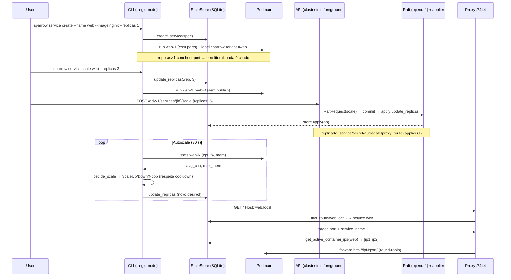

# Arquitetura do Sparrow

> v0.9.6 — descreve o que o código faz hoje. Tudo que é plano está marcado
> `FUTURO` na seção [Alvo / Roadmap](#10-alvo--roadmap-futuro-não-implementado).

## Visão Geral

Binário único `sparrow` (workspace Cargo: `sparrow` + crates
`core/podman/proto/raft/api/mcp`). Dois modos de operação:

- **Single-node (padrão):** o CLI fala direto com SQLite (`StateStore`) e com
  o Podman CLI (`PodmanRuntime`). Não há daemon, não há scheduler, não há
  reconciler. Comandos como `service create/scale/rm`, `deploy`, `autoscale`,
  `alert`, `secret`, `network`, `status` executam e terminam.
  (`src/main.rs:24-110`, `crates/core/src/state.rs`, `crates/podman/src/runtime.rs`)
- **Cluster (daemon foreground):** `sparrow cluster init` (ou `join`) sobe o
  processo em foreground e mantém três listeners via `tokio::select!`:
  API + dashboard em `7443`, proxy reverso em `7444`, Raft mTLS na
  `raft_port` (padrão `7444`, configurável — `src/main.rs:610-738`,
  `crates/core/src/config.rs:45-56`). `cluster init` gera CA + certs em
  `{data_dir}/certs`; `join` exige o bundle do líder.

```
┌─────────────────────────────────────────────────────────────────┐
│ sparrow (binário único)                                         │
│                                                                 │
│  SINGLE-NODE (comando termina)                                  │
│  CLI (clap, crates/core/src/cli.rs:16)                          │
│    │                                                            │
│    ├──► StateStore (SQLite WAL, Mutex<Connection>)              │
│    │      create_service / update_replicas / set_autoscale /    │
│    │      save_proxy_route / secrets / autoscale events         │
│    │                                                            │
│    └──► PodmanRuntime (shell-out `podman …`)                    │
│           run_container `{serviço}-{seq}` label                 │
│           `sparrow.service`, list/stats/logs/rm                 │
│                                                                 │
│  CLUSTER (foreground, `cluster init|join`)                      │
│  API axum 0.0.0.0:7443 ──► openraft 0.10-alpha.22 ──► applier   │
│    │                         │ election 1500–3000 ms,           │
│    │                         │ heartbeat 500 ms                 │
│    │                         │ (crates/raft/src/types.rs:41)    │
│    │                         └──► StateStore (mesmas tabelas)   │
│    │                              ops: upsert/scale/delete      │
│    │                              service, set/delete secret,   │
│    │                              set/delete autoscale,         │
│    │                              save/delete proxy_route       │
│    │                              (crates/api/src/applier.rs)   │
│    └──► Proxy reverso 0.0.0.0:7444 (HTTP, Host→round-robin)     │
└─────────────────────────────────────────────────────────────────┘
         │                    │                    │
┌────────┴────────┐   ┌───────┴───────┐   ┌────────┴────────┐
│ Podman local    │   │ Podman remoto │   │ Podman remoto   │
│ containers      │   │ containers    │   │ containers      │
│ web-1, web-2…   │   │ via API/Raft  │   │ via API/Raft    │
└─────────────────┘   └───────────────┘   └───────────────┘
```

Não existe `raft-rs`, `tonic`/gRPC, Quadlet, mesh Wireguard, Let's Encrypt/ACME,
CoreDNS, iptables gerenciado, seccomp/AppArmor ou `age` no código de hoje
(`grep` em `crates/ src/` não retorna esses símbolos). Ver seção 10.

## Componentes

### 1. CLI (clap)

`crates/core/src/cli.rs:16` — enum `Command`: `Cluster`, `Service`, `Node`,
`Network`, `Autoscale`, `Alert`, `Mcp`, `Deploy`, `Config`, `Db`, `Update`,
`Completion`, `Secret`, `Status`. Sub-enums: `ClusterAction`, `ServiceAction`,
`NodeAction`, `NetworkAction` (`Create { name, --subnet } | List | Rm`),
`AutoscaleAction` (`Set | Status | History | Pause | Resume`),
`AlertAction` (`Set { telegram|smtp } | List | History`), `SecretAction`,
`ConfigAction`, `UpdateAction`.

Exemplos reais (single-node executa e sai):

```bash
sparrow cluster init                    # sobe daemon foreground (API 7443 + proxy 7444 + Raft mTLS)
sparrow cluster join <leader-addr>:7443 --token SPARJOIN...  # entra no cluster
sparrow service create --name web --image nginx --replicas 1 [--domain web.local]
sparrow service scale web 3  # posicional NAME REPLICAS; via Podman direto; com host-port + réplicas>1 → erro literal
sparrow service logs web --follow
sparrow service ps web
sparrow node list                       # single-node: avisa que drain/rm exige cluster init
sparrow autoscale set web --min 2 --max 20  # só CPU/mem + cooldown (ver §7)
sparrow network create mynet [--subnet 10.88.0.0/16]
sparrow mcp --port 3000 --host 127.0.0.1 [--stdio]   # sem token (ver §9)
```

Regra host-port × réplicas (single-node e deploy): `desired_replicas > 1` com
`ports` não vazias aborta antes de criar qualquer container
(`src/main.rs:390-397`, `src/main.rs:971-984`):

```text
Cannot expose host ports [80] with 3 replicas in deploy.
Each replica would try to bind the same port.
```

Saída: só a réplica 1 recebe os `PortMapping`; réplicas 2…N sobem sem publish
(`src/main.rs:403-405`). Para múltiplas réplicas com uma porta pública, use
`--domain <domínio>` e o proxy na 7444 (roteia por `Host` para IPs internos).

### 2. Estado (SQLite)

`crates/core/src/state.rs` — `StateStore::new/migrate` com migrations inline,
`journal_mode=WAL, foreign_keys=ON`, `Mutex<Connection>`. Tabelas efetivas:
services (+ réplicas desejadas), autoscale policies + events, secrets
(envelope v2, ver §8), proxy_routes (`domain, target_port, service_name, tls`),
nodes/heartbeats, alert channels/events. Métodos usados pelo CLI, API e
applier: `create_service/get_service/list_services/update_replicas`,
`set_autoscale/get_autoscale`, `get_secret/list_proxy_routes`,
`get_active_container_ips`.

### 3. Runtime Podman

`crates/podman/src/runtime.rs` — `check_available`, `run_container`,
`list_containers`, `stats` (`podman stats --no-stream` → `(cpu %, mem, limite)`),
`logs`. Convenções reais:

- Nome: `{service}-{seq}` (`web-1`, `web-2`…).
- Label: `sparrow.service={service}` (filtro de listagem).
- Redes: nomes repassados como `--network <name>` (`run_container`,
  `src/main.rs:1024-1026`). Nenhum overlay/DNS/LB é gerenciado.
- `health_check_loop` a cada 30 s (`src/main.rs:1913`): reinicia containers
  falhos e repõe réplicas faltantes até `desired_replicas`. É um watchdog
  local, não um reconciler distribuído.

### 4. API Server (axum)

`crates/api/src/lib.rs:92-175` — `AppState`/`ClusterState`/`ProxyRoute`;
`crates/api/src/lib.rs:252-330` — rotas reais (prefixo `/api/v1`):

```text
GET    /health | /api/v1/health
GET    /api/v1/nodes | GET /api/v1/nodes/{id} (via cluster_status/list_nodes)
POST   /api/v1/nodes/{id}/heartbeat
GET    /api/v1/cluster/status
GET/POST /api/v1/proxy/routes | DELETE /api/v1/proxy/routes/{domain}
GET/POST /api/v1/autoscale | DELETE /api/v1/autoscale/{service_id}
GET    /api/v1/services | GET/DELETE /api/v1/services/{id}
POST   /api/v1/services/{id}/scale
GET    /api/v1/services/{id}/logs | GET /api/v1/services/{id}/logs/stream (SSE)
GET    /metrics
GET/POST /api/v1/alerts/channels | GET /api/v1/alerts/events
POST   /raft/append_entries | /raft/vote | /raft/snapshot | /raft/add_learner | /raft/promote
GET    /api/v1/secrets | GET/POST/DELETE /api/v1/secrets/{name}
GET    /ws/dashboard (+ dashboard SPA embutida)
fallback → proxy::handle_proxy (qualquer Host sem rota → 404)
```

Listener Raft mTLS separado (`start_mtls_raft_listener`, `:330-354`) serve só
`/raft/*` e exige client certs da mesma CA.

- **Rate-limit:** 100 req/min por IP → `429 {"error":"rate_limit"}`
  (`crates/api/src/lib.rs:178-224`).
- **Auth:** se `auth_token` configurado, exige `Authorization: Bearer <token>`
  → `401 {"error":"unauthorized"}`. Sem token, API local sem auth.
- **Métricas:** `GET /metrics` expõe 3 gauges (`:227-250`):
  `sparrow_services_total`, `sparrow_nodes_total`, `sparrow_proxy_routes_total`.
- **TLS da API:** opcional via `tls_cert`/`tls_key` (`start_api`, rustls).
  Sem cert/key, HTTP puro. Sem ACME/Let's Encrypt.
- **Configuração:** `crates/core/src/config.rs` — `SparrowConfig`
  (`ClusterConfig`/`RuntimeConfig`/`LoggingConfig`/`ApiConfig`). Defaults:
  `cluster.listen 0.0.0.0:7443`, `api.listen 127.0.0.1:7443`,
  `cluster.raft_port 7444`, `data_dir /var/lib/sparrow`, `backend podman`,
  `rootless true`.
- **Ports em `cluster init`:** API no `listen` (padrão 7443), proxy fixo na
  7444 (`start_proxy(proxy_state, 7444)`), Raft mTLS na `raft_port`
  (`src/main.rs:686-727`).
- **Docker:** `EXPOSE 7443 7444 7445`, `HEALTHCHECK CMD ["sparrow", "status"]`.

### 5. Consenso Raft (openraft)

`crates/raft/Cargo.toml` — `openraft 0.10.0-alpha.22` (não `raft-rs`).
`crates/raft/src/cluster.rs:65` — `RaftCluster::new/with_tls/init`,
`heartbeat_interval 500`, `election_timeout 1500–3000`
(`crates/raft/src/types.rs:41-48`). DBs `sparrow-{id}-raft-{log,sm}.db`.
Membership via `add_learner` + `promote_learner` (joint-consensus);
single-node funciona sem daemon, cluster exige daemon foreground.

O que é replicado de fato — o applier (`crates/api/src/applier.rs:17-25`):

```text
upsert_service | delete_service | scale
set_secret | delete_secret
set_autoscale | delete_autoscale
save_proxy_route | delete_proxy_route
```

Sem replicação de scheduler, containers, métricas ou logs. Cada nó executa
seus próprios containers via Podman local.

### 6. Reverse Proxy

`crates/api/src/proxy.rs` — `find_route` / `resolve_target` / `forward` /
`forward_ws`. Comportamento real:

1. `find_route(host)`: limpa `:porta` do `Host`, procura em
   `store.list_proxy_routes()` e cai para o cache em memória.
2. `resolve_target(route)`: lê `store.get_active_container_ips()` (ou cache
   `container_ips`) e escolhe por **round-robin** (`round_robin` map por
   `service_name`). Sem IPs → fallback `127.0.0.1:target_port`.
3. `forward`: reconstrói `http://{ip}:{port}{uri}`, reescreve `Host`,
   injeta `x-forwarded-for/proto/host`, encaminha via hyper. `forward_ws`
   faz o mesmo para `ws://` (tungstenite).
4. Proxy HTTP puro na porta 7444. O campo `tls` da rota é metadado persistido
   (dashboard mostra badge TLS/plain) — não há terminação TLS nem ACME no
   proxy. TLS opcional existe só na API (`start_api`) e mTLS no Raft.

O que o proxy **não** faz hoje: HTTPS/HTTP2, Let's Encrypt, roteamento por
path, least-conn/IP-hash, sticky sessions, health checks ativos, rate
limiting próprio (o rate-limit é o da API, 100/min), zero-downtime reload —
tudo `FUTURO` (ver §10).

### 7. Autoscaler

`crates/core/src/autoscale.rs` — `decide_scale` → `ScaleUp | ScaleDown | Noop`;
`poll_metrics` via `podman stats`; `run` em loop de **30 s** (`:158-160`).
Fontes reais: CPU média (%) e memória (bytes/limite). Parâmetros por serviço:
`min_replicas`, `max_replicas`, `cpu_target_percent`, `memory_target_percent`,
`cooldown_seconds` (padrão 60 s no CLI, `src/main.rs:1645-1656`) — durante o
cooldown a decisão é pulada (`autoscale.rs:189-193`). Sem request-rate, queue
depth, Prometheus custom ou cron (`FUTURO`).

### 8. Sistema de Alertas

`crates/core/src/alerts.rs:69` — canais reais: **`telegram` e `email`** (smtp
via lettre; `channel_type == "telegram" || channel_type == "email"`).
CLI: `alert set --channel-type telegram|smtp … | list | history`.
Sem webhook/Slack/Discord/PagerDuty, WebSocket dedicado ou app mobile no
código — `FUTURO`. Cooldown anti-spam + histórico no SQLite existem.

### 9. MCP Server

`crates/mcp/src/lib.rs:219-312` — 19 tools reais: `list_services`,
`get_service`, `list_nodes`, `scale_service`, `cluster_status`, `get_secret`,
`list_secrets`, `set_secret`, `delete_secret`, `service_logs`, `service_ps`,
`deploy_service` (rejeita host-port com réplicas > 1, mesma regra do CLI),
`deploy_compose`, `remove_service`, `set_autoscale`, `remove_autoscale`,
`proxy_add_route`, `proxy_remove_route`, `proxy_list_routes`.
Resources (`crates/mcp/src/resources.rs`): `sparrow://status` e
`sparrow://logs/{service}` (últimas 100 linhas por réplica, tag
`[container]`). Transporte: `sparrow mcp --port 3000 --host 127.0.0.1`
(SSE/HTTP) ou `--stdio`. **Sem token de autenticação.**

### 10. Secrets

`crates/core/src/crypto.rs` — AES-256-GCM com chave derivada por
**Argon2id** (m=19 MiB, t=2, p=1). Envelope v2:
`v2:<base64 salt 16 B>:<base64 nonce 12 B‖ciphertext>`. Formato v1 legado
(SHA-256 simples, sem salt) ainda é lido, não mais escrito. Vault:
precedência `SPARROW_VAULT_KEY` > `vault.key`, `0o600` no Unix. Sem rotação
automática (ver doc de segurança).

## Segurança (resumo do real)

| Ativo | Controle real | Observação |
|---|---|---|
| Raft entre nós | mTLS com CA gerada no `cluster init` | Exige certs da mesma CA; sem rotation automática |
| API | `Bearer` opcional + rate-limit 100/min | Sem token por padrão no localhost |
| Secrets | Argon2id + AES-256-GCM, arquivo `0o600` | Sem rotação; v1 legado só leitura |
| Podman | rootless por padrão, label `sparrow.service` | Containers via CLI `podman`, sem daemon central |
| Proxy | HTTP puro, sem TLS | Campo `tls` é metadado, não terminação |

Sem no código: mTLS obrigatório global, rotation 30 dias, seccomp/AppArmor,
`age`, overlay Wireguard, iptables por serviço (ver §10).

## Fluxo de Vida de um Serviço (real)



## 10. Alvo / Roadmap (`FUTURO` — não implementado)

Tudo abaixo aparecia na versão anterior deste doc no presente; hoje é plano:

- `FUTURO` **Scheduler** (spread/binpack/least-loaded/node-pin) — hoje cada
  nó roda o que o CLI/API mandou; sem decisão de placement.
- `FUTURO` **Reconciler distribuído** (loop 10 s desired-vs-real, rolling
  update, drain) — hoje só `health_check_loop` local de 30 s.
- `FUTURO` **gRPC/tonic e `raft-rs`** — o transporte real é axum/JSON sobre
  HTTPS-mTLS com `openraft 0.10-alpha.22`.
- `FUTURO` **Quadlet/systemd por serviço** — runtime real é `podman run/cli`.
- `FUTURO` **Mesh Wireguard + overlay /24 por serviço** — `WireguardManager`
  (`crates/core/src/network.rs`) só gera config/keys via `wg`/`wg-quick`,
  sem chamadores; redes reais são nomes Podman (ver `networking.md`).
- `FUTURO` **Proxy avançado**: 80/443, TLS/ACME-Let's Encrypt, roteamento por
  path, least-conn/IP-hash, sticky sessions, health checks 5 s, rate
  token-bucket, HTTP/2, gRPC — hoje: HTTP na 7444, Host→round-robin.
- `FUTURO` **Autoscale por** request-rate, queue depth, Prometheus custom,
  cron — hoje: CPU/mem via `podman stats`.
- `FUTURO` **Alertas** webhook/Slack/Discord/PagerDuty, WebSocket, app mobile,
  templates custom — hoje: telegram/email.
- `FUTURO` **Segurança**: rotation 30 dias, seccomp/AppArmor, `age`,
  network isolation via iptables/Wireguard — hoje: ver tabela acima.
