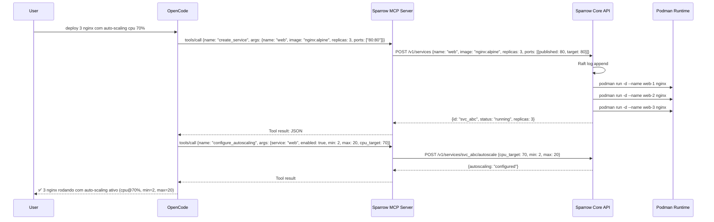

# MCP Server — Sparrow Controlado por IA

## Visão

Sparrow expõe um **MCP Server** (Model Context Protocol) que permite qualquer agente IA (OpenCode, Cursor, Copilot, etc.) controlar o cluster de containers diretamente.

```
┌──────────────────┐     MCP Protocol     ┌──────────────────┐
│  OpenCode        │◄────────────────────►│  Sparrow MCP     │
│  Cursor          │     stdio/HTTP       │  Server          │
│  Copilot         │                      │                  │
│  Qualquer MCP    │                      │  ┌────────────┐  │
│  Client          │                      │  │ Sparrow    │  │
└──────────────────┘                      │  │ Core       │  │
                                          │  │ (Rust)     │  │
                                          │  └────────────┘  │
                                          └──────────────────┘
```

## Como Funciona

Agente IA pode **criar, escalar, monitorar e gerenciar** serviços via ferramentas MCP:

```
User: "sobe mais 3 réplicas do web-api no cluster de produção"
IA:   ──► sparrow_mcp.scale_service("web-api", 8)
      ◄── "web-api escalado de 5 para 8 réplicas. 3 novas em node-2 e node-3."

User: "o que tá rodando no cluster?"
IA:   ──► sparrow_mcp.list_services()
      ◄── "8 serviços rodando: web-api(5), worker(12), redis(1)..."
```

## Ferramentas MCP

### Server Tools

```json
{
  "name": "sparrow_mcp",
  "version": "1.0.0",
  "description": "Control Sparrow container orchestrator from any MCP-compatible AI agent",
  "tools": [
    {
      "name": "list_services",
      "description": "List all services running in the cluster",
      "inputSchema": {
        "type": "object",
        "properties": {
          "cluster": {
            "type": "string",
            "description": "Cluster name (default: current context)",
            "optional": true
          },
          "status": {
            "type": "string",
            "description": "Filter by status: running, stopped, all",
            "enum": ["running", "stopped", "all"],
            "default": "all"
          }
        }
      }
    },
    {
      "name": "create_service",
      "description": "Create a new service (container deployment)",
      "inputSchema": {
        "type": "object",
        "properties": {
          "name": {
            "type": "string",
            "description": "Service name"
          },
          "image": {
            "type": "string",
            "description": "Container image (e.g., nginx:alpine, postgres:16)"
          },
          "replicas": {
            "type": "integer",
            "description": "Number of replicas",
            "default": 1,
            "minimum": 0,
            "maximum": 100
          },
          "ports": {
            "type": "array",
            "description": "Port mappings (e.g., ['80:80', '443:443'])",
            "items": {"type": "string"},
            "optional": true
          },
          "env": {
            "type": "object",
            "description": "Environment variables (key-value)",
            "additionalProperties": {"type": "string"},
            "optional": true
          },
          "volumes": {
            "type": "array",
            "description": "Volume mounts (e.g., ['/data:/var/lib/data'])",
            "items": {"type": "string"},
            "optional": true
          },
          "network": {
            "type": "string",
            "description": "Network to attach the service to",
            "optional": true
          },
          "restart": {
            "type": "string",
            "description": "Restart policy",
            "enum": ["always", "on-failure", "no"],
            "default": "always"
          },
          "command": {
            "type": "string",
            "description": "Command to run in the container",
            "optional": true
          },
          "labels": {
            "type": "object",
            "description": "Labels for the service",
            "additionalProperties": {"type": "string"},
            "optional": true
          }
        },
        "required": ["name", "image"]
      }
    },
    {
      "name": "scale_service",
      "description": "Scale a service to the desired number of replicas",
      "inputSchema": {
        "type": "object",
        "properties": {
          "service": {
            "type": "string",
            "description": "Service name or ID"
          },
          "replicas": {
            "type": "integer",
            "description": "Desired number of replicas",
            "minimum": 0,
            "maximum": 500
          }
        },
        "required": ["service", "replicas"]
      }
    },
    {
      "name": "stop_service",
      "description": "Stop a service (scale to 0) or remove it entirely",
      "inputSchema": {
        "type": "object",
        "properties": {
          "service": {
            "type": "string",
            "description": "Service name or ID"
          },
          "remove": {
            "type": "boolean",
            "description": "Remove the service entirely (default: false, just stops)",
            "default": false
          }
        },
        "required": ["service"]
      }
    },
    {
      "name": "get_service_logs",
      "description": "Get logs from a service's containers",
      "inputSchema": {
        "type": "object",
        "properties": {
          "service": {
            "type": "string",
            "description": "Service name or ID"
          },
          "tail": {
            "type": "integer",
            "description": "Number of lines to tail (default: 100)",
            "default": 100
          },
          "follow": {
            "type": "boolean",
            "description": "Stream logs continuously (default: false)",
            "default": false
          },
          "since": {
            "type": "string",
            "description": "Show logs since timestamp (e.g., '5m', '1h', '2026-06-16T10:00:00Z')",
            "optional": true
          }
        },
        "required": ["service"]
      }
    },
    {
      "name": "update_service",
      "description": "Rolling update of a service (change image, env, etc.)",
      "inputSchema": {
        "type": "object",
        "properties": {
          "service": {
            "type": "string",
            "description": "Service name or ID"
          },
          "image": {
            "type": "string",
            "description": "New image tag (leave empty to keep current)",
            "optional": true
          },
          "env": {
            "type": "object",
            "description": "Environment variables to update (key-value)",
            "additionalProperties": {"type": "string"},
            "optional": true
          },
          "parallelism": {
            "type": "integer",
            "description": "Number of containers to update at once (default: 1)",
            "default": 1,
            "optional": true
          },
          "delay": {
            "type": "string",
            "description": "Delay between updates (e.g., '10s', '30s')",
            "default": "10s",
            "optional": true
          }
        },
        "required": ["service"]
      }
    },
    {
      "name": "list_nodes",
      "description": "List all nodes in the cluster with status and resources",
      "inputSchema": {
        "type": "object",
        "properties": {
          "cluster": {
            "type": "string",
            "description": "Cluster name",
            "optional": true
          }
        }
      }
    },
    {
      "name": "cluster_status",
      "description": "Get overall cluster health, leader info, and resource usage",
      "inputSchema": {
        "type": "object",
        "properties": {
          "cluster": {
            "type": "string",
            "description": "Cluster name",
            "optional": true
          }
        }
      }
    },
    {
      "name": "configure_autoscaling",
      "description": "Enable, disable, or modify autoscaling policy for a service",
      "inputSchema": {
        "type": "object",
        "properties": {
          "service": {
            "type": "string",
            "description": "Service name or ID"
          },
          "enabled": {
            "type": "boolean",
            "description": "Enable or disable autoscaling"
          },
          "min_replicas": {
            "type": "integer",
            "description": "Minimum number of replicas",
            "optional": true
          },
          "max_replicas": {
            "type": "integer",
            "description": "Maximum number of replicas",
            "optional": true
          },
          "cpu_target": {
            "type": "integer",
            "description": "Target CPU percentage (1-100)",
            "optional": true
          },
          "memory_target": {
            "type": "integer",
            "description": "Target memory percentage (1-100)",
            "optional": true
          },
          "request_target": {
            "type": "integer",
            "description": "Target requests per second per replica",
            "optional": true
          }
        },
        "required": ["service", "enabled"]
      }
    },
    {
      "name": "exec_in_container",
      "description": "Execute a command in a running container (debugging)",
      "inputSchema": {
        "type": "object",
        "properties": {
          "service": {
            "type": "string",
            "description": "Service name or ID"
          },
          "container": {
            "type": "string",
            "description": "Container index or name (default: first replica)",
            "optional": true
          },
          "command": {
            "type": "string",
            "description": "Command to execute (e.g., 'ls -la', 'cat /etc/nginx/nginx.conf')"
          },
          "timeout": {
            "type": "integer",
            "description": "Command timeout in seconds (default: 30)",
            "default": 30,
            "optional": true
          }
        },
        "required": ["service", "command"]
      }
    },
    {
      "name": "list_networks",
      "description": "List all overlay networks in the cluster",
      "inputSchema": {
        "type": "object",
        "properties": {}
      }
    },
    {
      "name": "create_network",
      "description": "Create an overlay network for service communication",
      "inputSchema": {
        "type": "object",
        "properties": {
          "name": {"type": "string", "description": "Network name"},
          "subnet": {
            "type": "string",
            "description": "CIDR subnet (e.g., '10.0.5.0/24')",
            "optional": true
          },
          "driver": {
            "type": "string",
            "description": "Network driver: overlay, bridge",
            "default": "overlay",
            "optional": true
          },
          "internal": {
            "type": "boolean",
            "description": "Internal only (no external access)",
            "default": false,
            "optional": true
          }
        },
        "required": ["name"]
      }
    },
    {
      "name": "get_service_info",
      "description": "Get detailed information about a specific service",
      "inputSchema": {
        "type": "object",
        "properties": {
          "service": {
            "type": "string",
            "description": "Service name or ID"
          }
        },
        "required": ["service"]
      }
    },
    {
      "name": "rollback_service",
      "description": "Rollback a service to the previous version",
      "inputSchema": {
        "type": "object",
        "properties": {
          "service": {
            "type": "string",
            "description": "Service name or ID"
          }
        },
        "required": ["service"]
      }
    }
  ]
}
```

## Prompts (Recursos)

Além de ferramentas, o MCP server expõe **prompts** para guiar a IA:

```json
{
  "prompts": [
    {
      "name": "analyze_cluster",
      "description": "Analyze cluster health and suggest improvements",
      "arguments": []
    },
    {
      "name": "debug_service",
      "description": "Debug a service that is not working as expected",
      "arguments": [
        {"name": "service", "description": "Service name", "required": true},
        {"name": "issue", "description": "What's wrong", "required": true}
      ]
    },
    {
      "name": "optimize_deployment",
      "description": "Suggest optimizations for a deployment configuration",
      "arguments": [
        {"name": "service", "description": "Service name", "required": true}
      ]
    },
    {
      "name": "scale_decision",
      "description": "Explain why autoscaling made a particular decision",
      "arguments": [
        {"name": "service", "description": "Service name", "required": true},
        {"name": "decision_time", "description": "Timestamp of the decision", "required": false}
      ]
    }
  ]
}
```

## Recursos (Resources)

```json
{
  "resources": [
    {
      "uri": "sparrow://cluster/status",
      "name": "Cluster Status",
      "description": "Overall cluster health and metrics",
      "mimeType": "application/json"
    },
    {
      "uri": "sparrow://services",
      "name": "All Services",
      "description": "List of all services with current state",
      "mimeType": "application/json"
    },
    {
      "uri": "sparrow://services/{id}/logs",
      "name": "Service Logs",
      "description": "Recent logs for a specific service",
      "mimeType": "text/plain"
    },
    {
      "uri": "sparrow://services/{id}/spec",
      "name": "Service Specification",
      "description": "Full service configuration",
      "mimeType": "application/json"
    },
    {
      "uri": "sparrow://nodes",
      "name": "All Nodes",
      "description": "List of cluster nodes with status",
      "mimeType": "application/json"
    },
    {
      "uri": "sparrow://nodes/{id}/metrics",
      "name": "Node Metrics",
      "description": "CPU, memory, disk metrics for a node",
      "mimeType": "application/json"
    },
    {
      "uri": "sparrow://autoscale/history",
      "name": "Autoscale Decision History",
      "description": "Last 100 autoscaling decisions",
      "mimeType": "application/json"
    }
  ]
}
```

## Integração com Clientes

### OpenCode (Skill)

```json
// ~/.config/opencode/opencode.json
{
  "mcpServers": {
    "sparrow": {
      "command": "sparrow",
      "args": ["mcp"],
      "env": {
        "SPARROW_CLUSTER": "prod",
        "SPARROW_ENDPOINT": "http://localhost:7443"
      }
    }
  }
}
```

Depois no OpenCode:

```
/oc-orquestrador (ou direto no prompt)
"sobe 3 nginx com auto-scaling, expõe porta 80"

IA:
→ sparrow_mcp.create_network("frontend", "10.0.5.0/24")
→ sparrow_mcp.create_service({name: "web", image: "nginx:alpine", replicas: 3, ports: ["80:80"], network: "frontend"})
→ sparrow_mcp.configure_autoscaling({service: "web", enabled: true, min: 2, max: 20, cpu_target: 70})
→ "Cluster pronto: 3 nginx rodando com auto-scaling CPU@70%, rede frontend criada."
```

### Cursor

```json
{
  "mcpServers": {
    "sparrow": {
      "command": "sparrow",
      "args": ["mcp", "--port", "3000"]
    }
  }
}
```

### Claude Desktop (ou outro MCP client)

```json
{
  "mcpServers": {
    "sparrow": {
      "command": "/usr/local/bin/sparrow",
      "args": ["mcp", "--port", "3000"]
    }
  }
}
```

## Transporte

Suporta dois transportes MCP:

### 1. stdio (padrão — pra uso local)

```bash
sparrow mcp
# Lê JSON-RPC do stdin, escreve no stdout
# Ideal: OpenCode, Cursor — spawn like a subprocess
```

### 2. HTTP Streamable (pra remoto)

```bash
sparrow mcp --port 3000 --host 0.0.0.0
# SSE endpoint: http://localhost:3000/sse
# POST endpoint: http://localhost:3000/mcp
# Ideal: Claude Desktop, servidor remoto
```

## Autenticação

Quando MCP server está em modo HTTP, requer autenticação:

```bash
sparrow mcp --port 3000 --token <sparrow-token>
# Client precisa passar: Authorization: Bearer <token>
```

O token é o mesmo do cluster Sparrow (gerado no `sparrow cluster init`).

## Casos de Uso pra IA

### Deploy Automático

```
"Faz deploy da minha aplicação: frontend React, backend Node, PostgreSQL.
 3 réplicas cada, auto-scaling por CPU, rede isolada pros serviços se comunicarem."
```

### Diagnóstico

```
"O web-api está lento. Investiga: logs, CPU/memória, tráfego, erros recentes."
```

### Manutenção

```
"Faz rolling update do web-api pra imagem v2.3 com paralelismo 2."
```

### Otimização

```
"Analisa o cluster e sugere ajustes nos recursos e políticas de autoscaling."
```

### Segurança

```
"Lista todos os serviços expostos na porta 80/443 e verifica se têm health check."
```

## Implementação

Planejada pra Fase 2 do roadmap. O MCP server será um módulo separado dentro do Sparrow:

```
src/
└── mcp/
    ├── mod.rs              # MCP server init
    ├── tools.rs            # Tool definitions + handlers
    ├── prompts.rs          # Prompt templates
    ├── resources.rs        # Resource endpoints
    └── transport.rs        # stdio + HTTP transport
```

**Dependências Rust::**
```toml
[dependencies]
# MCP protocol implementation (no existing Rust SDK complete enough yet)
# Opções: implementar o protocolo manualmente (simples, ~500 linhas)
#         ou usar rmcp (Rust MCP - comunidade)
```

O protocolo MCP é simples o bastante pra implementar na mão:

```rust
// JSON-RPC 2.0 + MCP spec
// Request: {"jsonrpc":"2.0","id":1,"method":"tools/call","params":{"name":"scale_service","arguments":{...}}}
// Response: {"jsonrpc":"2.0","id":1,"result":{"content":[{"type":"text","text":"ok"}]}}
```

## Fluxo Completo


