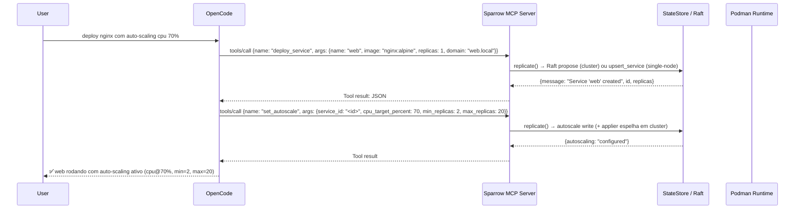

# MCP Server — Sparrow Controlado por IA

## Visão

Sparrow expõe um **MCP Server** (Model Context Protocol) que permite qualquer agente IA (OpenCode, Cursor, Copilot, etc.) controlar o cluster de containers diretamente.

```
┌──────────────────┐     MCP Protocol     ┌──────────────────┐
│  OpenCode        │◄────────────────────►│  Sparrow MCP     │
│  Cursor          │   stdio / SSE+POST   │  Server          │
│  Copilot         │                      │                  │
│  Qualquer MCP    │                      │  ┌────────────┐  │
│  Client          │                      │  │ Sparrow    │  │
└──────────────────┘                      │  │ Core       │  │
                                          │  │ (Rust)     │  │
                                          │  └────────────┘  │
                                          └──────────────────┘
```

Implementado em v0.9.6 no crate `sparrow-mcp` (`crates/mcp/src/{lib.rs,tools.rs,resources.rs}`).

## Como Funciona

Agente IA pode **criar, escalar, monitorar e gerenciar** serviços via ferramentas MCP:

```
User: "sobe o web-api para 8 réplicas"
IA:   ──► tools/call { "name": "scale_service", "arguments": {"id_or_name": "web-api", "replicas": 8} }
      ◄── réplicas desejadas atualizadas (via Raft quando em cluster, direto no SQLite em single-node)

User: "o que tá rodando no cluster?"
IA:   ──► tools/call { "name": "list_services", "arguments": {} }
      ◄── lista id, nome, imagem, réplicas, portas
```

Escritas (`deploy_service`, `scale_service`, `set_secret`, `set_autoscale`, `proxy_add_route`, …)
passam por `replicate()` (`crates/mcp/src/tools.rs:53-71`): em cluster propõem via Raft
(`OP_UPSERT_SERVICE` e demais ops do `sparrow_api::applier`) e o applier local espelha o commit;
em single-node escrevem direto no SQLite. O MCP **não** faz `POST /api/v1/services`
— essa rota nem existe (a API só tem `GET /api/v1/services`, `GET /api/v1/services/{id}`,
`DELETE /api/v1/services/{id}` e `POST /api/v1/services/{id}/scale`, `api/lib.rs:270-274`).

## Ferramentas MCP

Lista exata retornada por `tools/list` (`crates/mcp/src/lib.rs:214-320`). São 19 ferramentas:

| Ferramenta | Descrição | Parâmetros |
|---|---|---|
| `list_services` | Lista todos os serviços (id, nome, imagem, réplicas, portas) | — |
| `get_service` | Detalhe de um serviço (portas, chaves de env, volumes, networks, autoscaling) | `id_or_name` (obrigatório) |
| `list_nodes` | Lista nós do cluster | — |
| `scale_service` | Escala serviço para N réplicas (via Raft quando em cluster) | `id_or_name`, `replicas` (≥ 0, obrigatórios) |
| `cluster_status` | Saúde geral (nós, serviços, líder Raft, versão) | — |
| `get_secret` | Lê valor descriptografado de um secret | `name` (obrigatório) |
| `list_secrets` | Lista nomes de secrets | — |
| `set_secret` | Grava secret criptografado (mesmo envelope v2 do CLI/API; replicado em cluster) | `name`, `value` (obrigatórios) |
| `delete_secret` | Remove secret por nome | `name` (obrigatório) |
| `service_logs` | Últimas linhas agregadas de todas as réplicas vivas, marcadas por container (máx 200/requisição) | `name` (obrigatório), `tail` (1–200) |
| `service_ps` | Lista containers de um serviço | `name` (obrigatório) |
| `deploy_service` | Cria serviço (imagem, réplicas, portas, env, volumes, networks, restart, autoscale, domain). Rejeita host-port com réplicas > 1 | `name`, `image` (obrigatórios); `replicas`, `ports[]`, `env{}`, `volumes[]`, `networks[]`, `restart`, `autoscale{}`, `domain` |
| `deploy_compose` | Faz deploy de todos os serviços de um documento docker-compose (mesmo subset barulhento do `sparrow deploy`: chaves não suportadas falham) | `yaml` (obrigatório) |
| `remove_service` | Remove serviço e seus containers (replicado em cluster) | `name` (obrigatório) |
| `set_autoscale` | Define política de autoscale (min/max, alvos cpu/mem, cooldown, paused) | `service_id` (obrigatório); `min_replicas`, `max_replicas`, `cpu_target_percent`, `memory_target_percent`, `cooldown_seconds`, `paused` |
| `remove_autoscale` | Remove política de autoscale | `service_id` (obrigatório) |
| `proxy_add_route` | Adiciona rota do reverse-proxy (domínio → serviço:porta) | `domain`, `service_name`, `target_port` (1–65535, obrigatórios); `tls` |
| `proxy_remove_route` | Remove rota por domínio | `domain` (obrigatório) |
| `proxy_list_routes` | Lista rotas do reverse-proxy | — |

Não existem em v0.9.6 (removidos deste doc por não terem handler em `tools.rs:24-45`):
`create_service`, `stop_service`, `update_service`, `rollback_service`, `exec_in_container`,
`get_service_info`, `create_network`, `list_networks`, `configure_autoscaling`.
Use `deploy_service` / `remove_service` / `set_autoscale` no lugar.

Regra de host-port (`tools.rs:140-153`, mesma do `boot_spec` em `src/main.rs`):
host-ports com `replicas > 1` são rejeitadas com erro — use `replicas: 1` ou um `domain` de proxy.

## Prompts

O servidor v0.9.6 **não expõe prompts** (nenhum `prompts/list` em `crates/mcp/src/lib.rs`,
nenhum `prompt` em `crates/mcp/src/`). Os prompts `analyze_cluster`, `debug_service`,
`optimize_deployment` e `scale_decision` documentados anteriormente nunca foram implementados.
[roadmap] Expor prompts de análise/debug/otimização.

## Recursos (Resources)

`resources/list` (`crates/mcp/src/lib.rs:321-343`) expõe exatamente 2 recursos
(handlers em `crates/mcp/src/resources.rs:20-43`):

```json
{
  "resources": [
    {
      "uri": "sparrow://status",
      "name": "Cluster Status",
      "description": "Current cluster status and node health",
      "mimeType": "application/json"
    },
    {
      "uri": "sparrow://logs/{service}",
      "name": "Service Logs",
      "description": "Recent log lines for a service",
      "mimeType": "text/plain"
    }
  ]
}
```

URIs antigas (`sparrow://cluster/status`, `sparrow://services`, `sparrow://services/{id}/logs`,
`sparrow://services/{id}/spec`, `sparrow://nodes`, `sparrow://nodes/{id}/metrics`,
`sparrow://autoscale/history`) não existem — qualquer outro URI retorna
`Unknown resource URI` (`resources.rs:39`).

## Integração com Clientes

### OpenCode (stdio — spawn como subprocesso)

```json
// ~/.config/opencode/opencode.json
{
  "mcpServers": {
    "sparrow": {
      "command": "sparrow",
      "args": ["mcp", "--stdio"]
    }
  }
}
```

Sem variáveis `SPARROW_CLUSTER` / `SPARROW_ENDPOINT` — o binário não lê nenhuma das duas
(confirmado: nenhum `env::var` correspondente no crate MCP ou no dispatch `Command::Mcp`).
O servidor MCP usa o `StateStore` e o `PodmanRuntime` locais do processo que o atende
(`src/main.rs:194-227`).

Depois no OpenCode:

```
"sobe 3 nginx com auto-scaling, expõe porta 80"
IA:
→ tools/call deploy_service {name: "web", image: "nginx:alpine", replicas: 1, domain: "web.local"}
  (replicas 1 + domain: host-port com N réplicas é rejeitado — tools.rs:140-153)
→ tools/call set_autoscale {service_id: "<id>", min_replicas: 2, max_replicas: 20, cpu_target_percent: 70}
→ "Cluster pronto: web criado com auto-scaling CPU@70%, rota web.local configurada."
```

### Cursor (stdio)

```json
{
  "mcpServers": {
    "sparrow": {
      "command": "sparrow",
      "args": ["mcp", "--stdio"]
    }
  }
}
```

Para modo remoto via SSE, rode `sparrow mcp --port 3000 --host 127.0.0.1` e aponte
o cliente para `http://127.0.0.1:3000/sse` + `POST http://127.0.0.1:3000/messages`.

### Claude Desktop (ou outro MCP client, stdio)

```json
{
  "mcpServers": {
    "sparrow": {
      "command": "/usr/local/bin/sparrow",
      "args": ["mcp", "--stdio"]
    }
  }
}
```

## Transporte

Dois transportes (`crates/mcp/src/lib.rs:83-97,362-453`; flags em `crates/core/src/cli.rs:53-66`):

### 1. stdio (opt-in — pra uso local)

```bash
sparrow mcp --stdio
# Lê JSON-RPC do stdin, escreve no stdout
# Ideal: OpenCode, Cursor — spawn como subprocesso
```

### 2. SSE + POST (padrão — pra remoto)

```bash
sparrow mcp --port 3000 --host 127.0.0.1
# SSE endpoint:  GET  http://127.0.0.1:3000/sse
# POST endpoint: POST http://127.0.0.1:3000/messages
# Ideal: servidor remoto
```

O endpoint POST é `/messages` — `/mcp` nunca existiu no `router()` (`lib.rs:92-97`).
Flags reais: `--port` (default `3000`), `--host` (default `127.0.0.1`), `--stdio`.
Não há flag `--token`.

## Autenticação

Sem autenticação em v0.9.6: `Command::Mcp` (`cli.rs:53-66`) tem só `port`/`host`/`stdio`,
e nem o `router()` MCP nem `start_mcp_stdio` checam `Authorization`.
O Bearer token + rate-limit 100/min existem só na API HTTP (`api/lib.rs:178-221),
não no MCP. [roadmap] Exigir Bearer no modo SSE/HTTP.

## Casos de Uso pra IA

### Deploy Automático

```
"Faz deploy da minha aplicação: frontend React, backend Node, PostgreSQL."
→ deploy_service uma vez por serviço (ports como ["8080:80"], env como {"KEY": "val"} ou {"KEY": "secret:nome"})
→ deploy_compose com o YAML inteiro (subset barulhento: chave não suportada falha a chamada)
→ proxy_add_route por domínio público
```

### Diagnóstico

```
"O web-api está lento. Investiga: logs, containers, status."
→ service_logs {name: "web-api", tail: 100}
→ service_ps {name: "web-api"}
→ get_service {id_or_name: "web-api"} + cluster_status
```

### Manutenção

```
"Escala o web-api para 5 réplicas e depois remove o worker antigo."
→ scale_service {id_or_name: "web-api", replicas: 5}
→ remove_service {name: "worker-old"}
```

Rolling update com paralelismo/delay, `exec` em container e rollback não existem como
ferramentas em v0.9.6 ([roadmap]).

### Otimização

```
"Analisa o cluster e sugere ajustes nos recursos e políticas de autoscaling."
→ cluster_status + list_services + get_service por serviço
→ set_autoscale / remove_autoscale para aplicar
```

### Segurança

```
"Lista os secrets e as rotas expostas."
→ list_secrets + proxy_list_routes
→ get_service por serviço para conferir portas/env (só chaves, nunca valores)
```

## Implementação

Implementado na Fase 4 do roadmap. O MCP server é o crate `sparrow-mcp`:

```
crates/mcp/
├── Cargo.toml        # sparrow-mcp 0.9.6 (axum SSE, sem SDK MCP externo)
├── src/
│   ├── lib.rs        # McpServer::router (/sse + /messages), tools/list, resources/list, stdio
│   ├── tools.rs      # handle_tool_call + 19 handlers (deploy/scale/secrets/autoscale/proxy)
│   └── resources.rs  # sparrow://status + sparrow://logs/{service}
```

Sem `prompts.rs` / `transport.rs` separados — transporte vive em `lib.rs`
(`sse_handler`, `messages_handler`, `start_mcp_stdio`, `start_mcp`).

O protocolo é JSON-RPC 2.0 direto:

```rust
// Request: {"jsonrpc":"2.0","id":1,"method":"tools/call","params":{"name":"scale_service","arguments":{...}}}
// Response: {"jsonrpc":"2.0","id":1,"result":{"content":[{"type":"text","text":"ok"}]}}
```

## Fluxo Completo


