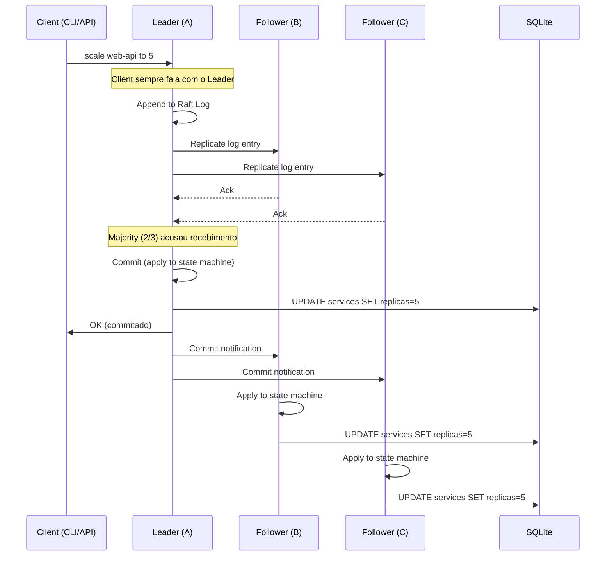
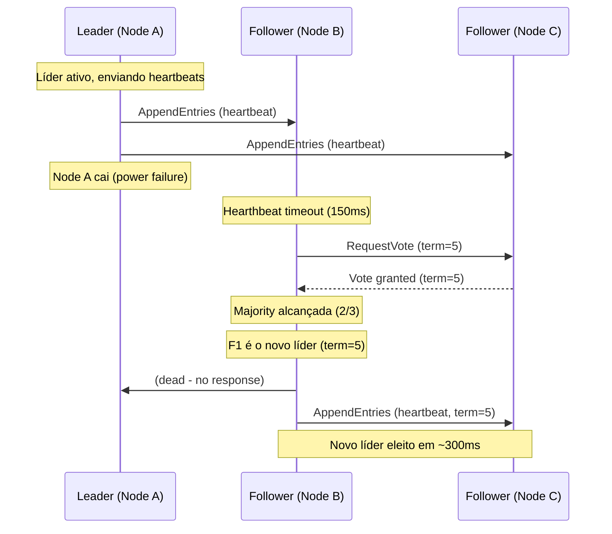

# Estado e Consenso (Raft)

## Por Que Raft?

Em um cluster multi-node, precisamos de consenso para:

1. **Quem é o líder?** — só um nó toma decisões de scheduling
2. **Estado consistente** — todos os nós veem o mesmo estado
3. **Tolerância a falhas** — se o líder cai, outro assume
4. **Log de auditoria** — toda mudança é registrada e replicada

Raft é o algoritmo de consenso mais usado depois do etcd/ZooKeeper. Mais simples de implementar que Paxos.

## O Que Vai no Raft

Só dados **críticos**:

```
Raft Log (append-only, replicado)
├── ServiceSpec
│   ├── imagem, portas, volumes, envs
│   ├── réplicas desejadas
│   ├── restart policy
│   └── autoscaling config
│
├── Node Membership
│   ├── join/leave de nós
│   ├── status (ready, down, draining)
│   └── labels e recursos
│
├── Scaling Decisions (audit trail)
│   ├── decisão: timestamp, de→para, motivo
│   └── quién decidiu (autoscaler, CLI, API)
│
├── Cluster Config
│   ├── CIDR das redes
│   ├── TLS certs (fingerprint)
│   └── secrets (encrypted)
│
└── Events
    ├── deploy realizado
    ├── rollback
    ├── node failure
    └── scaling action
```

Dados **não** vão no Raft:

```
✗ Logs de container (muito volume)
✗ Métricas em tempo real (muito volume)
✗ Estado efêmero de containers (reconciliável)
✗ Cache de imagens
```

## Arquitetura

```
┌──────────────────────────────────────────────────┐
│                 Raft Cluster                     │
│                                                  │
│  ┌──────────┐    ┌──────────┐    ┌──────────┐  │
│  │  Leader  │    │ Follower │    │ Follower │  │
│  │  Node A  │    │  Node B  │    │  Node C  │  │
│  │          │    │          │    │          │  │
│  │ ┌──────┐ │    │ ┌──────┐ │    │ ┌──────┐ │  │
│  │ │Raft  │◄┼────┼─│Raft  │◄┼────┼─│Raft  │ │  │
│  │ │      │ │    │ │      │ │    │ │      │ │  │
│  │ │Log   │ │    │ │Log   │ │    │ │Log   │ │  │
│  │ └──────┘ │    │ └──────┘ │    │ └──────┘ │  │
│  │ ┌──────┐ │    │ ┌──────┐ │    │ ┌──────┐ │  │
│  │ │SQLite│ │    │ │SQLite│ │    │ │SQLite│ │  │
│  │ │(snap)│ │    │ │(snap)│ │    │ │(snap)│ │  │
│  │ └──────┘ │    │ └──────┘ │    │ └──────┘ │  │
│  └──────────┘    └──────────┘    └──────────┘  │
│                                                  │
│  Leader: toda escrita → Raft → réplicas OK → commit │
│  Follower: só leitura do SQLite snapshot           │
│  Se líder cai: election → novo líder em <5s       │
└──────────────────────────────────────────────────┘
```

## Fluxo de Escrita



## Tolerância a Falhas

```
Cluster de 3 nós: tolera 1 falha
Cluster de 5 nós: tolera 2 falhas
Cluster de 7 nós: tolera 3 falhas

Fórmula: tolera (N-1)/2 falhas
```

## Eleição de Líder



## Persistência Local (SQLite)

Cada nó mantém um SQLite local com:

```
Tables:
├── services
│   ├── id (UUID)
│   ├── name
│   ├── image
│   ├── desired_replicas
│   ├── spec (JSON blob - portas, volumes, envs, etc)
│   └── created_at / updated_at
│
├── nodes
│   ├── id
│   ├── addr
│   ├── status (ready, down, draining)
│   ├── labels (JSON)
│   └── resources (JSON - cpu, mem, disk)
│
├── containers
│   ├── id
│   ├── service_id
│   ├── node_id
│   ├── podman_id
│   ├── ip_address
│   └── status
│
├── autoscale_decisions (append-only)
│   ├── id
│   ├── service_id
│   ├── from_replicas
│   ├── to_replicas
│   ├── reason (text)
│   └── timestamp
│
├── networks
│   ├── id
│   ├── name
│   ├── cidr
│   └── driver
│
├── secrets
│   ├── id
│   ├── name
│   └── encrypted_data (BLOB)
│
├── raft_log (Raft usa isso)
│   └── index, term, data, commit_status
│
└── events (append-only)
    ├── type (scale, deploy, failure, recovery)
    ├── service_id
    ├── detail (JSON)
    └── timestamp
```

## Snapshot

Periodicamente, o leader tira um snapshot do estado e compacta o log do Raft:

```
Raft Log antes do snapshot:
[1] create service web-api    \
[2] scale web-api to 3        │ 
[3] create network mynet       ├── Todos esses são resumidos
[4] join node B                │   no snapshot
[5] scale web-api to 5        /
[6] (atual) → continua daqui

Após snapshot:
[6] scale web-api to 5
[snapshot: services=12, nodes=4, networks=3]
```

## CLI

> Estado real v0.9.6 (`crates/core/src/cli.rs:ClusterAction`): `cluster init`,
> `cluster join <addr> --token`, `cluster join-token --node-id/--addr`,
> `cluster status`, `cluster members`. Sem `cluster audit` ou `cluster election`.

```bash
# Ver estado do cluster Raft
sparrow cluster status

Cluster: prod
Leader: node-1 (10.0.0.1:7443)
Nodes: 3 (online)
Election timeout: 1500-3000ms (`crates/raft/src/types.rs:41-48`)

# Ver membros
sparrow cluster members
```

## Comparativo Raft vs etcd vs Swarm

| Feature | Swarm (Raft interno) | Sparrow (openraft) | K8s (etcd) |
|---|---|---|---|
| Engine | Raft (Moby) | openraft 0.10-alpha.22 (`crates/raft/Cargo.toml`) | etcd (Raft) |
| Storage | Memory + wal | SQLite + wal | bbolt + wal |
| Snapshot | Manual | Automático (openraft + applier local) | Automático |
| Election time | ~1-3s | ~1.5-3s (1500-3000ms configurado) | ~1-3s |
| Tamanho mínimo | 3 nós | 1 nó (single-node sem Raft) | 3 nós |
| Escrita | Síncrona | Síncrona (líder → maioria → applier) | Síncrona |
| Leitura | Só líder | Líder + followers (SQLite local espelhado) | Só líder |
| Backup | dump manual | SQLite backup/vacuum (`sparrow db`) | etcdctl snapshot |
| Complexidade | Média | Média (lib openraft, não implementação própria) | Média (usar etcd) |

> **Nota v0.9.6**: decisão de engine já tomada — openraft em uso (`crates/raft/src/`).
> A frase original ("considerar usar uma lib raft em vez de implementar do zero")
> é pré-projeto e está preservada só neste adendo como histórico.
